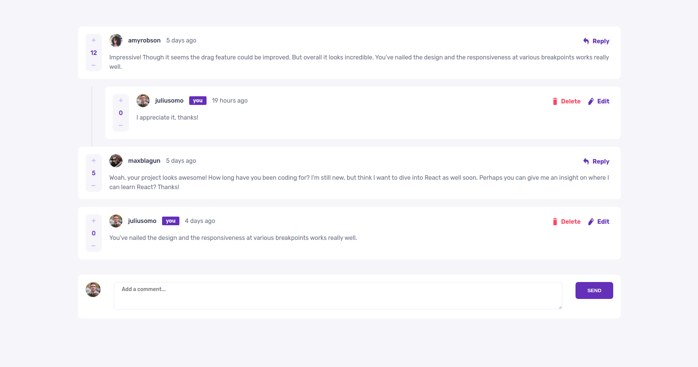

# interactive-comments-section-main

## Table of Contents

- [About](#about)
- [Getting Started](#getting_started)
- [Usage](#usage)
- [Demo](#demo)
- [Deployment](#deployment)

## About <a name = "about"></a>

This project is about building a custom interactive comments section similar to the ones used in social media applications. Built to complete a [challenge](https://www.frontendmentor.io/challenges/interactive-comments-section-iG1RugEG9) on [Frontend Mentor](https://www.frontendmentor.io/).

This is a working front-end solution. To add the back-end solution, head over to [this](https://github.com/MedJelidi/interactive-comments-section-main-back) repository.

## Getting Started <a name = "getting_started"></a>

These instructions will get you a copy of the project up and running on your local machine for development and testing purposes.

### Prerequisites

[Node.js](https://nodejs.org)

[NPM](https://nodejs.org)

[Angular CLI](https://angular.io/cli)

### Installing

[Node.js](https://nodejs.org/en/download/) (version >= v12.22.8)

[NPM](https://nodejs.org/en/download/) (version >= 6.14.15)

Angular CLI

```
npm install -g @angular/cli
```

## Usage <a name = "usage"></a>

Enter working directory and run
```
ng serve -o
```
## Demo <a name = "demo"></a>

Mobile


Delete (Mobile)


Update (Mobile)


Reply (Mobile)


Desktop



Delete (Desktop)


## Deployment <a name = "deployment"></a>

https://interactive-comments-section-main.pages.dev/
